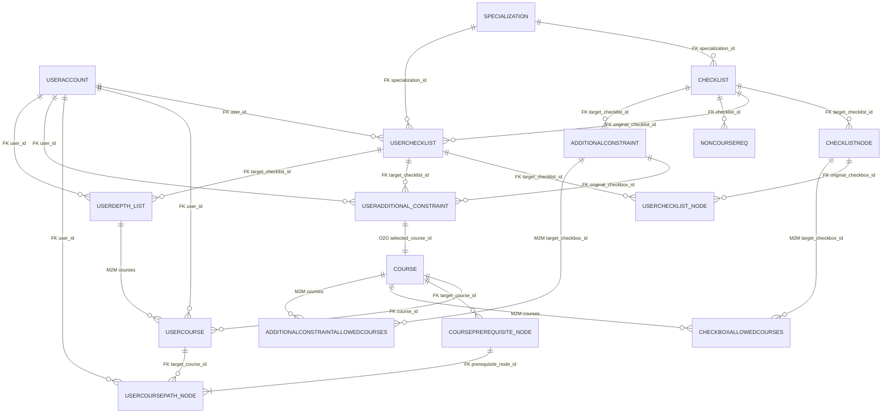

# Database Schema

## Table of Contents
- [Entity Relationship Diagram](#entity-relationship-diagram)
- [Tables and Columns](#tables-and-columns)
    - [Users & Authentication](#users--authentication)
    - [Specializations & Checklists](#specializations--checklists)
    - [User Checklists](#user-checklists)
    - [Courses](#courses)
    - [Additional Constraints](#additional-constraints)
    - [Depth Lists & Other](#depth-lists--other)

## Entity Relationship Diagram



## Tables and Columns

### Users & Authentication

| **UserAccount** | Type | Notes |
|---|---|---|
| id | UUID (PK) | Primary key |
| created_at | DateTime | Auto-set on creation |
| updated_at | DateTime | Auto-updated |
| is_active | Boolean | Account active status |
| is_staff | Boolean | Admin flag |
| is_superuser | Boolean | Superuser flag |
| first_name | String | User's first name |
| email | String (UQ) | Unique email |
| start_year | SmallInt | Year user started |

---

### Specializations & Checklists

| **Specialization** | Type | Notes |
|---|---|---|
| id | Integer (PK) | Primary key |
| created_at | DateTime | Auto-set on creation |
| updated_at | DateTime | Auto-updated |
| name | String | Program name |
| description | Text | Program description |

| **Checklist** | Type | Notes |
|---|---|---|
| id | Integer (PK) | Primary key |
| created_at | DateTime | Auto-set on creation |
| updated_at | DateTime | Auto-updated |
| year | SmallInt | Year of checklist |
| units_required | SmallInt | Required units |
| specialization_id | FK → Specialization | Which specialization |

| **ChecklistNode** | Type | Notes |
|---|---|---|
| id | Integer (PK) | Primary key |
| created_at | DateTime | Auto-set on creation |
| updated_at | DateTime | Auto-updated |
| requirement_type | String | 'head', 'group', 'checkbox' |
| title | String | Node title |
| units_required | SmallInt | Units (groups only) |
| target_checklist_id | FK → Checklist | Parent checklist |
| parent_id | FK → ChecklistNode (self) | MPPT tree node |

| **CheckboxAllowedCourses** | Type | Notes |
|---|---|---|
| id | Integer (PK) | Primary key |
| created_at | DateTime | Auto-set on creation |
| updated_at | DateTime | Auto-updated |
| target_checkbox_id | FK → ChecklistNode | Which checkbox |
| courses | M2M → Course | Allowed courses |

---

### User Checklists

| **UserChecklist** | Type | Notes |
|---|---|---|
| id | Integer (PK) | Primary key |
| created_at | DateTime | Auto-set on creation |
| updated_at | DateTime | Auto-updated |
| year | SmallInt | Year of checklist |
| user_id | FK → UserAccount | Which user |
| units_required | SmallInt | Required units |
| taken_course_units | SmallInt | Units taken |
| planned_course_units | SmallInt | Units planned |
| completed | Boolean | Checklist complete |
| specialization_id | FK → Specialization | User's specialization |
| original_checklist_id | FK → Checklist | Based on template |

| **UserChecklistNode** | Type | Notes |
|---|---|---|
| id | Integer (PK) | Primary key |
| created_at | DateTime | Auto-set on creation |
| updated_at | DateTime | Auto-updated |
| requirement_type | String | 'head', 'group', 'checkbox' |
| title | String | Node title |
| units_required | SmallInt | Units (groups only) |
| units_gathered | SmallInt | Units so far |
| completed | Boolean | Node complete |
| user_id | FK → UserAccount | Which user |
| target_checklist_id | FK → UserChecklist | Parent checklist |
| original_checkbox_id | FK → ChecklistNode | Reference to template |
| selected_course_id | FK → UserCourse | Selected course |
| parent_id | FK → UserChecklistNode (self) | MPPT tree node |

---

### Courses

| **Course** | Type | Notes |
|---|---|---|
| id | Integer (PK) | Primary key |
| created_at | DateTime | Auto-set on creation |
| updated_at | DateTime | Auto-updated |
| code | String (UQ) | Course code (e.g. 'CS') |
| number | String (UQ) | Course number (e.g. '137') |
| units | SmallInt | Credit units |
| category | Array[String] | Math, CS, Hum, etc. |
| corequisites | Text | Corequisite courses |
| antirequisites | Text | Antirequisite courses |
| title | Text | Course title |
| description | Text | Course description |
| num_uwflow_ratings | SmallInt | Number of ratings |
| uwflow_liked_rating | SmallInt | Likeability rating |
| uwflow_easy_ratings | SmallInt | Difficulty rating |
| uwflow_useful_ratings | SmallInt | Usefulness rating |

| **CoursePrerequisiteNode** | Type | Notes |
|---|---|---|
| id | Integer (PK) | Primary key |
| created_at | DateTime | Auto-set on creation |
| updated_at | DateTime | Auto-updated |
| target_course_id | FK → Course | Course with prereqs |
| node_type | String | 'group' or 'course' |
| parent_id | FK → CoursePrerequisiteNode (self) | MPPT tree node |
| leaf_course_id | FK → Course | Prerequisite course (if leaf) |
| num_children_required | SmallInt | Children required (if group) |

---

### User Courses

| **UserCourse** | Type | Notes |
|---|---|---|
| id | Integer (PK) | Primary key |
| created_at | DateTime | Auto-set on creation |
| updated_at | DateTime | Auto-updated |
| user_id | FK → UserAccount | Which user |
| course_id | FK → Course | Which course |
| course_list | String | 'taken', 'planned', 'wishlist' |
| prereqs_met | Boolean | Prerequisites satisfied |

| **UserCoursePathNode** | Type | Notes |
|---|---|---|
| id | Integer (PK) | Primary key |
| created_at | DateTime | Auto-set on creation |
| updated_at | DateTime | Auto-updated |
| user_id | FK → UserAccount | Which user |
| target_course_id | FK → UserCourse | Target course |
| prerequisite_node_id | FK → CoursePrerequisiteNode | Prereq node in tree |
| parent_id | FK → UserCoursePathNode (self) | Tree structure |
| branch_completed | Boolean | Path branch complete |

---

### Additional Constraints

| **AdditionalConstraint** | Type | Notes |
|---|---|---|
| id | Integer (PK) | Primary key |
| created_at | DateTime | Auto-set on creation |
| updated_at | DateTime | Auto-updated |
| title | String | Constraint title |
| requirement_type | String | 'group' or 'checkbox' |
| num_courses_required | SmallInt | Courses required (groups) |
| target_checklist_id | FK → Checklist | Parent checklist |
| parent_id | FK → AdditionalConstraint (self) | MPPT tree node |

| **AdditionalConstraintAllowedCourses** | Type | Notes |
|---|---|---|
| id | Integer (PK) | Primary key |
| created_at | DateTime | Auto-set on creation |
| updated_at | DateTime | Auto-updated |
| target_checkbox_id | FK → AdditionalConstraint | Constraint checkbox |
| courses | M2M → Course | Allowed courses |

| **UserAdditionalConstraint** | Type | Notes |
|---|---|---|
| id | Integer (PK) | Primary key |
| created_at | DateTime | Auto-set on creation |
| updated_at | DateTime | Auto-updated |
| requirement_type | String | 'group' or 'checkbox' |
| title | String | Constraint title |
| num_courses_required | SmallInt | Courses required (groups) |
| num_courses_gathered | SmallInt | Courses satisfied |
| completed | Boolean | Constraint complete |
| user_id | FK → UserAccount | Which user |
| target_checklist_id | FK → UserChecklist | Parent checklist |
| original_checkbox_id | FK → AdditionalConstraint | Reference to template |
| selected_course_id | O2O → Course | Selected course (unique per constraint) |
| parent_id | FK → UserAdditionalConstraint (self) | MPPT tree node |

---

### Depth Lists & Other

| **UserDepthList** | Type | Notes |
|---|---|---|
| id | Integer (PK) | Primary key |
| created_at | DateTime | Auto-set on creation |
| updated_at | DateTime | Auto-updated |
| user_id | FK → UserAccount | Which user |
| target_checklist_id | FK → UserChecklist | Parent checklist |
| courses | M2M → UserCourse | Courses in list |
| is_chain | Boolean | Is depth chain |
| total_units | SmallInt | Total units |
| num_courses | SmallInt | Number of courses |

| **NonCourseRequirement** | Type | Notes |
|---|---|---|
| id | Integer (PK) | Primary key |
| created_at | DateTime | Auto-set on creation |
| updated_at | DateTime | Auto-updated |
| year | SmallInt | Year requirement applies |
| description | Text | Requirement description |
| checklist_id | FK → Checklist | Parent checklist |
```